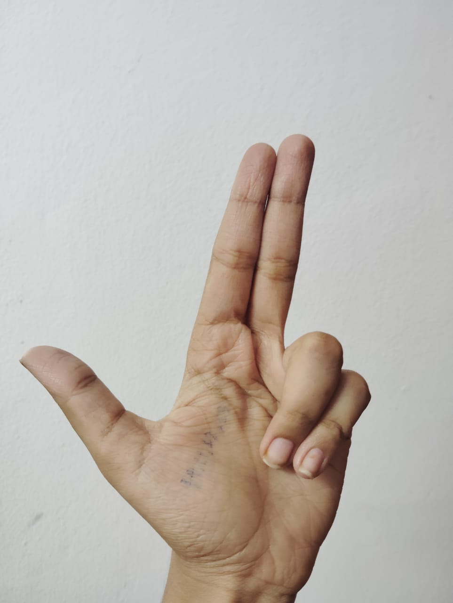
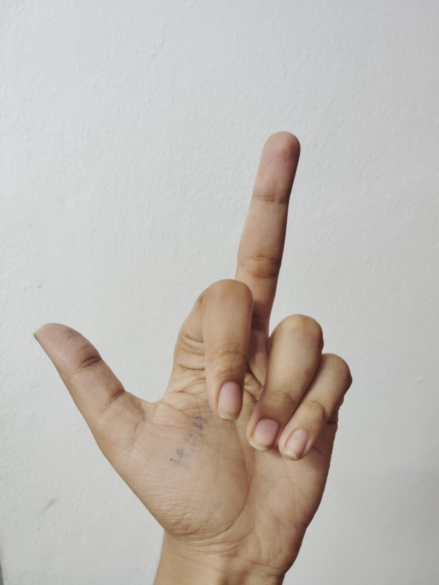

# 🖐️ Virtual Mouse & Gesture-Based System Control

## 🎯 Overview  
This project implements a **Virtual Mouse System** that allows users to interact with their computer using **hand gestures** instead of a physical mouse. Using **OpenCV**, **MediaPipe**, and system control libraries like `pyautogui`, `pycaw`, and `screen_brightness_control`, it enables control over:  

- **Mouse movement**  
- **Left & right clicks**  
- **Scrolling**  
- **System brightness**  
- **System volume**  

All operations are performed in **real-time** through webcam input.

---

## ⚙️ Features

| Feature | Gesture | Description |
|----------|----------|-------------|
| 🖱️ **Mouse Movement** | One hand open (thumb + index + middle fingers) with little & ring finger closed and thumb touching index finger bottom point | Moves the mouse pointer according to the index finger |
| 👆 **Left Click** | One hand, little & ring fingers closed, thumb open and **not touching** index finger, index finger bent | Triggers left click |
| ✌️ **Right Click** | One hand, little & ring fingers closed, thumb open and **not touching** index finger, middle finger bent | Triggers right click |
| ⬆️ **Scroll Up** | One hand, thumb + index + middle fingers open, index & middle fingers together (attached), little finger open, ring finger closed | Scrolls the screen upward |
| ⬇️ **Scroll Down** | One hand, thumb + index + middle fingers open, index & middle fingers together (attached), ring finger open, little finger closed | Scrolls the screen downward |
| 💡 **Brightness Control** | Left hand fully open, distance between thumb & index tip increases | Screen brightness increases |
| 🔊 **Volume Control** | Right hand fully closed, distance between thumb & index tip increases | System volume increases |
| ❌ **Quit Application** | Press `q` on keyboard or use **Exit** button | Gracefully exits the program |
| ▶️ **Start / Stop / Exit** | App.py buttons | Asks for camera permissions and manages the start/stop of gesture control |

---

        

## ✋ Two-Hand vs One-Hand Logic

- **Two Hands Visible** → Activates **brightness and volume control**  
  - **Left Hand:** Adjusts **brightness** (distance between thumb & index)  
  - **Right Hand:** Adjusts **volume** (distance between thumb & index)  

- **One Hand Visible** → Performs **mouse actions**  
  - **Mouse movement**: Little & ring finger closed, thumb touches bottom of index finger  
  - **Left click / Right click**: Little & ring closed, thumb open but not touching index, index/middle finger bent for click  
  - **Scroll up / down**: Index & middle fingers together, thumb+middle+index open, little/ring finger determines scroll direction  

- If no hands are visible, brightness, volume, and mouse controls remain inactive.

---

## 🧠 How It Works

1. **Hand Detection:**  
   Uses **MediaPipe Hands** to detect hand landmarks in real time.  

2. **Gesture Recognition:**  
   The program interprets the relative positions of fingers (index, middle, thumb, ring, little) to map them to predefined actions.  

3. **Action Execution:**  
   - **OpenCV** displays live video with feedback.  
   - **pyautogui** handles mouse movement, click, and scroll.  
   - **pycaw** controls system volume.  
   - **screen_brightness_control** adjusts screen brightness.  
   - **Tkinter frontend (app.py)** handles **Start / Stop / Exit** buttons with camera permission prompts.

---

## 🧩 Dependencies

Install all dependencies with:

```bash
pip install opencv-python mediapipe numpy pycaw comtypes screen-brightness-control pyautogui tk cvzone
